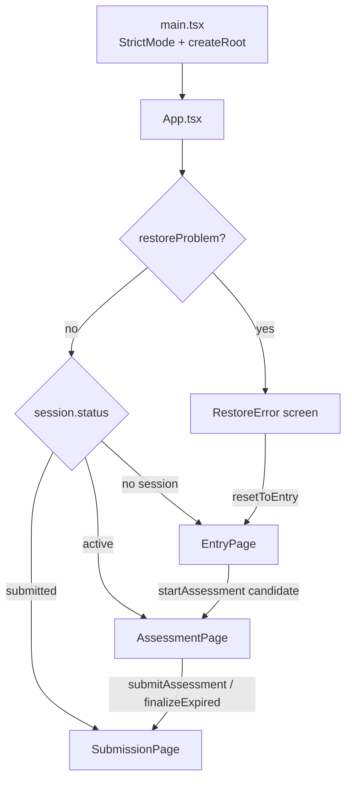
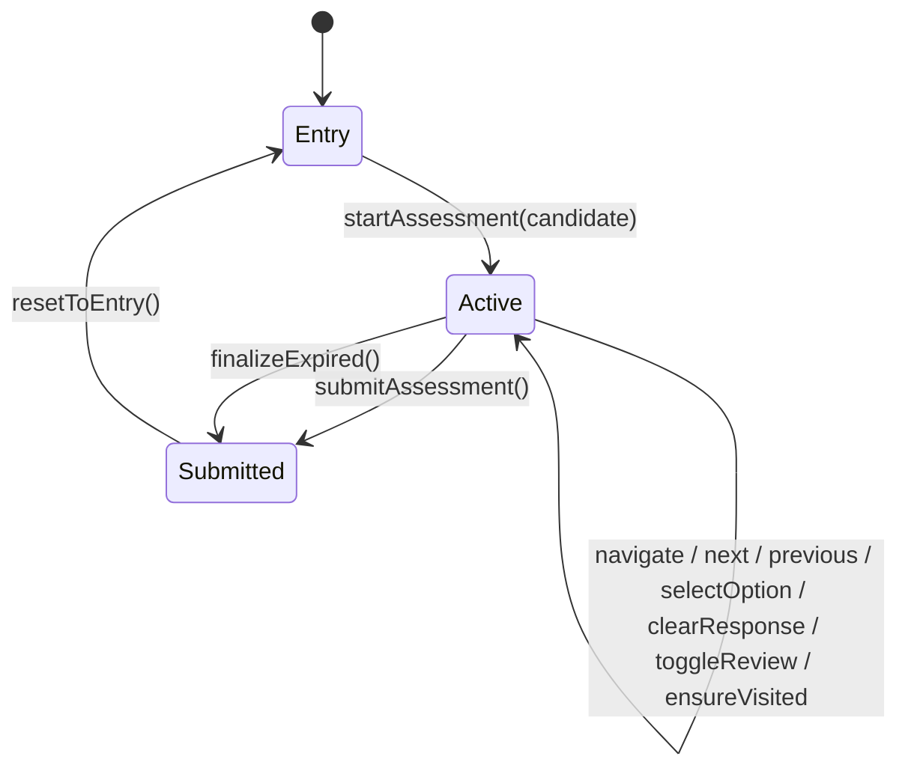
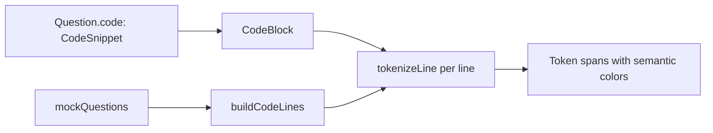

# Architecture

This document describes how the Codeathon exam workstation is structured, how a
session flows through the app, and where to extend it.

## Overview

Codeathon is a **frontend-only** single-page application. It simulates the
participant-facing portion of a competitive MCQ exam:

1. **Entry** — collect and validate candidate details, confirm conditions.
2. **Assessment** — present questions with a countdown, answering tools, and a
   question palette.
3. **Submission** — lock the session and confirm receipt. No results are shown.

All state is client-side and persisted to `localStorage`. There is no server,
network request, database, authentication, scoring, or result computation. The
`Question.correctOptionId` field exists only as a placeholder for a future
backend and is never rendered.

### Goals

- A faithful, distraction-free, light-mode exam UI matching `design/DESIGN.md`.
- A refresh-safe session that survives reloads without a router or backend.
- Clean boundaries so a real backend can be dropped in later.

### Non-goals

- Backend, API, persistence beyond the browser, or server-side proctoring.
- Scoring, grading, results, leaderboards, analytics, or answer review.
- Authentication, multi-user support, or dark mode.

## Technology

| Concern    | Choice                                              |
| ---------- | --------------------------------------------------- |
| UI runtime | React 19                                            |
| Language   | TypeScript ~6 with strict, erasable-syntax settings |
| Build      | Vite 8 + `@vitejs/plugin-react`                     |
| Styling    | Tailwind CSS v4 (`@theme` tokens in `src/index.css`)|
| Lint       | oxlint                                              |
| State      | React hooks + `localStorage`                        |

Notably absent by design: a router (navigation is status-based) and a state
management library (`useAssessment` is the single store).

## App flow

The app shell (`src/main.tsx`) mounts `App`, which acts as a small status-based
router.



`main.tsx` is the only place that imports `./App.tsx` with an explicit extension;
all other imports are extensionless.

## Session state machine

`useAssessment` owns the session lifecycle. The persisted `AssessmentSession`
only ever has status `active` or `submitted`; "entry" is the absence of a
session.



- `startAssessment` builds a fresh session with `expiresAt = now + 45min`.
- `finalizeExpired` marks the session submitted and pins `submittedAt` to
  `expiresAt` (not "now"), so an expired session reports an accurate time.
- `resetToEntry` clears every storage key and returns to `EntryPage`.
- On load, `App` also finalizes immediately if an active session is already past
  `expiresAt`.

## Directory responsibilities

| Path                       | Responsibility                                            |
| -------------------------- | --------------------------------------------------------- |
| `src/App.tsx`              | Status-based routing, corrupt-session recovery, expiry check |
| `src/pages/`               | Screen composition (`EntryPage`, `AssessmentPage`, `SubmissionPage`) |
| `src/components/entry/`    | Candidate form, consent panel, system/camera check        |
| `src/components/assessment/`| Question card, options, code block, metadata, palette, controls, timer, submit modal |
| `src/components/layout/`   | Fixed `AppHeader` and `AssessmentLayout` shell             |
| `src/components/submission/`| Locked completion screen                                  |
| `src/components/ui/`       | `Icon` (Material Symbols wrapper)                          |
| `src/hooks/`               | Central store, countdown, local proctoring                 |
| `src/lib/`                 | Storage, code tokenizer, rich text, utilities             |
| `src/data/mockQuestions.ts`| 30 mock questions, duration, department options           |
| `src/types/assessment.ts`  | Shared domain types                                       |

## Data model

Core types live in `src/types/assessment.ts`.

```ts
interface AssessmentSession {
  sessionId: string;
  candidate: Candidate;
  startedAt: number;
  expiresAt: number;              // absolute deadline (refresh-safe)
  currentQuestion: number;        // 1-based
  status: "entry" | "active" | "submitted";
  responses: Record<string, OptionId | null>;
  reviewFlags: Record<string, boolean>;
  visited: Record<string, boolean>;
  submittedAt: number | null;
}

interface Question {
  id: string;
  index: number;
  category: string;
  difficulty: "Easy" | "Medium" | "Hard";
  marks: number;
  negativeMarks: number;
  question: string;
  options: QuestionOption[];
  code?: CodeSnippet;
  correctOptionId?: OptionId;     // NEVER rendered
}
```

`QuestionState` is the derived per-question view for the UI:

```ts
interface QuestionState {
  selectedOption: OptionId | null;
  visited: boolean;
  markedForReview: boolean;
}
```

## Persistence

`src/lib/storage.ts` is the **only** module that touches `localStorage`. It is
guarded for SSR safety and never throws on quota or access errors.

| Key                        | Value                     |
| -------------------------- | ------------------------- |
| `codeathon_session`        | Serialized `AssessmentSession` |
| `codeathon_answers`        | `responses` mirror        |
| `codeathon_flags`          | `reviewFlags` mirror      |
| `codeathon_visited`        | `visited` mirror          |
| `codeathon_proctor_events` | Rolling log (last 200)    |

Every mutating action in `useAssessment` routes through a local `commit(session)`
helper that writes the session plus the granular mirrors. On load,
`storage.loadSession()` returns a discriminated `LoadResult`:

- `missing` — no session; go to `EntryPage`.
- `corrupt` — invalid JSON/shape; show the `RestoreError` screen.
- `ok` — resume from the stored session.

## Hooks

### `useAssessment` — central store

Returns the session and derived values (`currentQuestion`, `counts`,
`stateFor`) plus actions. Derived values are computed during render; the
`UseAssessmentApi` interface is the contract consumed by `AssessmentPage`.

Key behaviors:

- Most actions are no-ops unless `status === "active"`; `submitAssessment` can
  run from any non-null session, and `resetToEntry` always clears.
- Every mutation calls `commit(next)` — including `next`/`previous`/`navigate`.
- `ensureVisited` is called when the current question changes, marking it visited.

### `useAssessmentTimer` — countdown

```ts
useAssessmentTimer(expiresAt: number | null, onExpire?: () => void): TimerState
```

- Ticks every 500 ms against `Date.now()`; the source of truth is the absolute
  `expiresAt`, so reloads cannot reset it.
- `remainingMs = max(0, expiresAt - now)`.
- Tiers: `normal`, `low` (≤ 10 min), `critical` (≤ 5 min); `expired` at ≤ 0.
- `onExpire` is held in a ref and invoked from an effect when `expired` flips
  true, avoiding stale closures.

### `useProctoring` — local-only monitoring

```ts
useProctoring(enabled: boolean): ProctoringState
```

- Logs `visibilitychange`, window `blur`/`focus`, fullscreen exit, and camera
  outcomes to the event log (`TAB_HIDDEN`, `WINDOW_BLUR`, `CAMERA_GRANTED`, ...).
- On mount it only *probes* camera permission via the Permissions API — it never
  prompts. `requestCameraVerification()` is user-invoked and calls
  `getUserMedia`, stopping tracks immediately and resolving gracefully when
  permission is denied or unavailable.
- Events are stored locally and never transmitted. The UI states this explicitly.

## Assessment canvas

`AssessmentPage` composes a responsive 12-column grid:

- **Left rail** — progress summary, session metadata, and a local focus log.
- **Center** — `QuestionMetadata`, `QuestionCard` (with optional `CodeBlock`),
  and sticky `AssessmentControls`.
- **Right rail** — `QuestionNavigator` palette (becomes a bottom drawer below
  `lg`).

Keyboard shortcuts, ignored while focus is in an input/textarea/select or
content-editable element:

| Key            | Action              |
| -------------- | ------------------- |
| `1`–`4`        | Select option A–D   |
| `←` / `→`      | Previous / next     |
| `M`            | Toggle mark-for-review |
| `Esc`          | Close submit modal  |

The submit dialog (`SubmitModal`) summarizes answered / marked / remaining and
requires confirmation before `submitAssessment()`.

## Code highlighting

A dependency-free tokenizer powers code snippets:



`tokenizeLine` emits `plain | comment | keyword | type | function | number |
string` tokens; `buildCodeLines` attaches line numbers. Token colors use the
dark editor surface tokens (`inverse-surface`, `primary-fixed`, etc.). Inline
code in prose is rendered by `lib/richText.tsx`.

## Styling system

- Tailwind CSS v4 is configured CSS-first in `src/index.css` via `@theme`.
- Semantic color tokens (e.g. `surface`, `primary`, `tertiary`, `error`,
  `amber-*`) and typography tokens map directly to `design/DESIGN.md`.
- Custom `font-*` utilities (`font-headline-md`, `font-body-md`, `font-label-sm`,
  `font-code-body`) bind Plus Jakarta Sans / JetBrains Mono and carry size,
  weight, and tracking.
- Spacing/radius tokens (`--spacing-gutter`, `--spacing-space-md`,
  `--radius-lg`, ...) generate utilities like `p-gutter` and `rounded-lg`.
- Unknown class names silently do nothing, so new tokens must be added to
  `src/index.css` first.

Icons come from Material Symbols through the `ui/Icon` wrapper. Light mode only.

## Accessibility

- The submit dialog exposes `role="dialog"`, `aria-modal`, and
  `aria-labelledby`, and closes on `Esc` or backdrop click.
- The countdown exposes `role="timer"`; the expiry notice uses `role="alert"`.
- Palette buttons expose descriptive `aria-label`s with current/answered/marked state.
- Keyboard shortcuts are disabled while typing in form fields.
- All decorative elements are marked `aria-hidden` where appropriate.

## Privacy & security

- No network requests of any kind — the app is fully self-contained.
- Proctoring is local-only and clearly labeled as such; it degrades gracefully
  when permissions are denied.
- Correct answers are stored in mock data but never reach the rendered DOM.
- All `localStorage` access is centralized in one guarded module.

## Extension points

To connect a real backend later:

1. Replace `src/data/mockQuestions.ts` with fetched questions, keeping the
   `Question` type (drop `correctOptionId` from the client payload).
2. Swap `expiresAt` for a server-authoritative deadline; the timer already reads
   from an absolute timestamp.
3. Replace `src/lib/storage.ts` internals with API calls behind the same
   interface, and let the persistence layer sync `commit()` writes.
4. Submit the `responses` map to the server in `submitAssessment`; the UI never
   needs to know the outcome.

## Build & tooling

- `npm run dev` — Vite dev server with HMR.
- `npm run build` — `tsc -b` (project references) then `vite build`.
- `npm run lint` — oxlint with the React plugin; `react/rules-of-hooks` is an error.
- TypeScript enforces `verbatimModuleSyntax` (type-only imports),
  `erasableSyntaxOnly` (no enums/namespaces), and unused-symbol checks, so the
  build fails on violations.

See [`AGENTS.md`](AGENTS.md) for contribution conventions and the manual
verification checklist.
