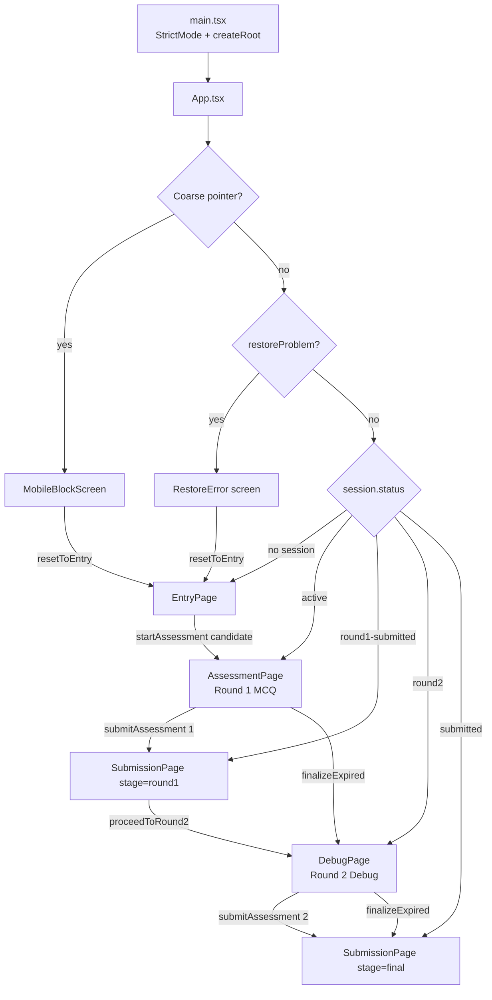
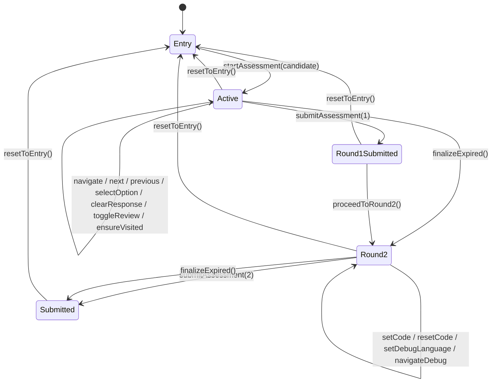
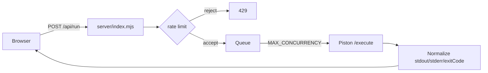
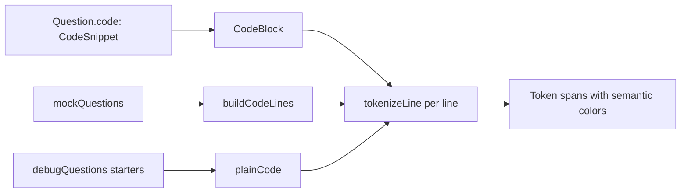

# Architecture

This document describes how the Codeathon assessment workstation is structured,
how a session flows through both rounds, and where to extend it.

## Overview

Codeathon is a single-page application that simulates the participant-facing
portion of a two-round competitive exam:

1. **Entry** — collect the team name and access password, request fullscreen.
2. **Round 1 (MCQ)** — 60 questions with a 45-minute countdown, answering tools,
   and a question palette.
3. **Round 2 (Debug)** — 20 code-debugging problems with a 60-minute countdown,
   a per-language editor, and real execution against a local Piston instance.
4. **Submission** — lock the session and confirm receipt. No results are shown.

Assessment state lives in the browser and is persisted to `localStorage`. The
only backend is `server/index.mjs`, a dependency-free proxy in front of a
self-hosted Piston instance. There is no database, no authentication service, no
scoring, and no result computation. The `Question.correctOptionId` field exists
only as a placeholder for a future backend and is never rendered.

### Goals

- A faithful, distraction-free, light-mode exam UI matching `design/DESIGN.md`.
- A refresh-safe session that survives reloads without a router or database.
- Real code execution for Round 2, with the browser never touching Piston.
- Clean boundaries so a real backend can be dropped in later.

### Non-goals

- Database, external API, or server-side proctoring.
- Scoring, grading, results, leaderboards, analytics, or answer review.
- Dark mode, theme switching, or mobile support.
- Returning to Round 1 after Round 2 begins — the assessment moves forward only.

## Technology

| Concern    | Choice                                               |
| ---------- | ---------------------------------------------------- |
| UI runtime | React 19                                             |
| Language   | TypeScript ~6 with strict, erasable-syntax settings  |
| Build      | Vite 8 + `@vitejs/plugin-react`                      |
| Styling    | Tailwind CSS v4 (`@theme` tokens in `src/index.css`) |
| Lint       | oxlint                                               |
| State      | React hooks + `localStorage`                         |
| Execution  | Node `http` server proxying to Piston                |

Notably absent by design: a router (navigation is status-based), a state
management library (`useAssessment` is the single store), and any runtime
dependency beyond React.

## App flow

`src/main.tsx` mounts `App`, which acts as a status-based router. It also owns
the mobile block, the corrupt-session screen, and the fullscreen guard.


```mermaid
flowchart TD
  M[main.tsx<br/>StrictMode + createRoot] --> App[App.tsx]
  App --> Mobile{Coarse pointer?}
  Mobile -- yes --> Block[MobileBlockScreen]
  Mobile -- no --> Restore{restoreProblem?}
  Restore -- yes --> Error[RestoreError screen]
  Restore -- no --> Status{session.status}
  Status -- no session --> Entry[EntryPage]
  Status -- active --> Active[AssessmentPage<br/>Round 1 MCQ]
  Status -- round1-submitted --> R1Done[SubmissionPage stage=round1]
  Status -- round2 --> Debug[DebugPage<br/>Round 2 Debug]
  Status -- submitted --> Final[SubmissionPage stage=final]
  Entry -- startAssessment candidate --> Active
  Active -- submitAssessment 1 --> R1Done
  Active -- finalizeExpired --> Debug
  R1Done -- proceedToRound2 --> Debug
  Debug -- submitAssessment 2 --> Final
  Debug -- finalizeExpired --> Final
  Block -- resetToEntry --> Entry
  Error -- resetToEntry --> Entry
```

`App` also runs an expiry sweep on every session change: an `active` session past
`expiresAt`, or a `round2` session past `round2ExpiresAt`, is finalized
immediately. This is what makes a reload after the deadline behave correctly.

## Session state machine

`useAssessment` owns the session lifecycle. A persisted session always has status
`active`, `round1-submitted`, `round2`, or `submitted`; `entry` is modelled as
the *absence* of a session.


```mermaid
stateDiagram-v2
  [*] --> Entry
  Entry --> Active: startAssessment(candidate)
  Active --> Active: navigate / next / previous / selectOption / clearResponse / toggleReview / ensureVisited
  Active --> Round1Submitted: submitAssessment(1)
  Active --> Round2: finalizeExpired()
  Round1Submitted --> Round2: proceedToRound2()
  Round2 --> Round2: setCode / resetCode / setDebugLanguage / navigateDebug
  Round2 --> Submitted: submitAssessment(2)
  Round2 --> Submitted: finalizeExpired()
  Active --> Entry: resetToEntry()
  Round1Submitted --> Entry: resetToEntry()
  Round2 --> Entry: resetToEntry()
  Submitted --> Entry: resetToEntry()
```

Key behaviors:

- `startAssessment` builds a fresh session with `expiresAt = now + 45min`,
  `round2ExpiresAt = null`, and `debugLanguage = "C++"`.
- Round 1 actions are no-ops unless `status === "active"`; Round 2 actions are
  no-ops unless `status === "round2"`. Each group is gated on its own status, so
  the two rounds cannot corrupt each other's state.
- `proceedToRound2` only runs from `round1-submitted`, and is the only user-driven
  path into Round 2. It sets `round2ExpiresAt = now + 60min` and resets
  `currentDebug` to 1 while preserving `codeEdits`.
- `finalizeExpired` is overloaded. From `active` it *advances to Round 2* rather
  than ending the assessment, so a team that exhausts Round 1 time still gets the
  debugging round. From `round2` it marks the session `submitted` and pins
  `submittedAt` to `round2ExpiresAt` (not "now") so the recorded time is honest.
- `resetToEntry` clears every storage key and returns to `EntryPage`. It is also
  the fullscreen-guard breach handler.
- `commit()` is called by every mutation, including `next`/`previous`/`navigate`.

## Directory responsibilities

| Path                        | Responsibility                                             |
| --------------------------- | ---------------------------------------------------------- |
| `src/App.tsx`               | Status-based routing, mobile block, expiry sweep, guard wiring |
| `src/pages/`                | Screen composition (`EntryPage`, `AssessmentPage`, `DebugPage`, `SubmissionPage`) |
| `src/components/entry/`     | `CandidateForm` (team name + password)                     |
| `src/components/assessment/`| Question card, options, code block, metadata, palette, controls, submit modal |
| `src/components/debug/`     | Problem panel, code editor, language toggle, debug controls, output terminal, submit modal |
| `src/components/layout/`    | `AppHeader`, `AssessmentLayout`, plus the `FullscreenWarning`, `MobileBlockScreen`, and `TimeOverScreen` guards |
| `src/components/submission/`| `SubmissionConfirmation`, reused for both round 1 and final |
| `src/components/ui/`        | `Icon` (Material Symbols wrapper)                          |
| `src/hooks/`                | Central store, countdown, fullscreen guard, mobile detection |
| `src/lib/`                  | Storage, execution client, code tokenizer, fullscreen helpers, rich text, utilities |
| `src/data/mockQuestions.ts` | 60 Round 1 MCQs, `ASSESSMENT_DURATION_MS`                   |
| `src/data/debugQuestions.ts`| 20 Round 2 problems, `ROUND2_DURATION_MS`                   |
| `src/types/assessment.ts`   | Shared domain types                                         |
| `server/index.mjs`          | Execution proxy and static file server                      |

## Data model

Core types live in `src/types/assessment.ts`.

```ts
type AssessmentStatus =
  | "entry"
  | "active"
  | "round1-submitted"
  | "round2"
  | "submitted";

interface Candidate {
  teamName: string;
  password: string;
}

interface AssessmentSession {
  sessionId: string;
  candidate: Candidate;
  startedAt: number;
  expiresAt: number;              // absolute Round 1 deadline (refresh-safe)
  currentQuestion: number;        // 1-based
  status: AssessmentStatus;
  responses: Record<string, OptionId | null>;
  reviewFlags: Record<string, boolean>;
  visited: Record<string, boolean>;
  submittedAt: number | null;
  round2ExpiresAt: number | null; // absolute Round 2 deadline
  currentDebug: number;           // 1-based
  codeEdits: Record<string, string>; // keyed `${questionId}:${language}`
  debugLanguage: DebugProgramLanguage;
  hintReveals: Record<string, boolean>; // problem ids whose hint was unlocked
}

interface Question {
  id: string;
  index: number;
  question: string;
  options: QuestionOption[];
  code?: CodeSnippet;
  correctOptionId?: OptionId;     // NEVER rendered
}

type DebugProgramLanguage = "C++" | "Python" | "Java";

interface DebugQuestion {
  id: string;
  index: number;
  title: string;
  difficulty: "Easy" | "Medium" | "Hard";
  statement: string;
  starters: Record<DebugProgramLanguage, string[]>;
  sampleCases: Record<DebugProgramLanguage, DebugCase[]>;
  bugHints: Record<DebugProgramLanguage, string>;
}
```

`QuestionState` is the derived per-question view for the Round 1 UI:

```ts
interface QuestionState {
  selectedOption: OptionId | null;
  visited: boolean;
  markedForReview: boolean;
}
```

`codeEdits` is keyed by `<questionId>:<language>` so a team can work the same
problem in C++ and Python without either overwriting the other. `debugCounts`
derives the "edited" tally by splitting on `:` and counting distinct question
ids.

## Persistence

`src/lib/storage.ts` is the **only** module that touches `localStorage`. It is
guarded for SSR safety (`typeof window === "undefined"`) and never throws on
quota or access errors — a failed write degrades to in-memory state only.

| Key                        | Value                        |
| -------------------------- | ---------------------------- |
| `codeathon_session`        | Serialized `AssessmentSession` |
| `codeathon_answers`        | `responses` mirror           |
| `codeathon_flags`          | `reviewFlags` mirror         |
| `codeathon_visited`        | `visited` mirror             |
| `codeathon_code_edits`     | `codeEdits` mirror           |

`commit(session)` writes the session plus all four mirrors, so the granular keys
never drift from the session blob.

On load, `storage.loadSession()` returns a discriminated `LoadResult`:

- `missing` — no session; go to `EntryPage`.
- `corrupt` — invalid JSON or failed the `isSessionLike` shape check; show
  `RestoreError`.
- `ok` — resume from the stored session, after `withRound2Defaults` backfills the
  Round 2 fields and migrates pre-Round-2 `codeEdits` keys to the
  `<id>:C++` shape.

`isSessionLike` deliberately accepts sessions *without* the Round 2 fields, so a
session saved by an older build loads instead of being discarded as corrupt.

## Hooks

### `useAssessment` — central store

Returns the session, derived values (`currentQuestion`, `currentDebugQuestion`,
`counts`, `debugCounts`, `stateFor`), and every action. Derived values are
computed during render; `UseAssessmentApi` is the contract consumed by both
`AssessmentPage` and `DebugPage`.

- Each action guards on the status it owns, so a Round 1 action during Round 2 is
  a no-op rather than a crash.
- `ensureVisited` is called from an effect when the current question changes.
- `resetCode` restores a problem's starter for the *current* language only.
- `revealHint(questionId)` unlocks a problem's hint. Like every other Round 2
  action it is gated on `status === "round2"`, is idempotent, and commits.

### `useAssessmentTimer` — countdown

```ts
useAssessmentTimer(expiresAt: number | null, onExpire?: () => void): TimerState
```

- Ticks every 500 ms against `Date.now()`; the source of truth is the absolute
  deadline, so reloads cannot reset it. Passing `null` parks the timer, which is
  how each page keeps only its own round ticking.
- `remainingMs = max(0, expiresAt - now)`.
- Tiers: `normal`, `low` (≤ 10 min), `critical` (≤ 5 min); `expired` at ≤ 0.
- `onExpire` is held in a ref and invoked from an effect when `expired` flips
  true, avoiding stale closures.

### `useFullscreenGuard` — proctoring enforcement

```ts
useFullscreenGuard(enabled: boolean, graceMs: number, onBreach: () => void)
```

- Enabled only while `status` is `active` or `round2`.
- `fullscreenchange`, `visibilitychange`, and window `blur`/`focus` all feed one
  breach state machine. A breach starts a `graceMs` (10 s) countdown rendered by
  `FullscreenWarning`; a 250 ms interval ticks the remaining time.
- Regaining fullscreen, focus, and visibility in time calls `disarm()` and clears
  the warning. Letting it expire fires `onBreach` exactly once.
- `onBreach` is held in a ref, so the guard never re-arms because a callback
  identity changed.
- A fullscreen-exit breach additionally re-checks `isFullscreen()` before
  disarming, so returning to the tab is not enough — the user must actually
  re-enter fullscreen.

### `useIsMobile` — platform gate

Matches `(pointer: coarse)`. `App` renders `MobileBlockScreen` for coarse
pointers, which is an intentional product decision rather than a responsive
fallback.

### `useProctoring` — removed

An earlier iteration logged `visibilitychange`, blur/focus, fullscreen exit, and
camera outcomes to a `codeathon_proctor_events` log. The fullscreen guard
superseded it, and the hook was never mounted, so it and its supporting types
(`ProctorEvent`, `ProctorEventType`, `CameraStatus`), the `ConsentPanel` /
`SystemCheck` entry components, and the storage key have all been deleted.

Proctoring is now `useFullscreenGuard` alone: enforcement in the moment, no
persisted event log. If a durable, locally stored event log is ever wanted again,
it belongs behind the `storage` module like every other key.

## Round 1 canvas

`AssessmentPage` composes a responsive grid:

- **Left rail** — progress summary and session metadata.
- **Center** — `QuestionMetadata`, `QuestionCard` (with optional `CodeBlock`),
  and sticky `AssessmentControls`.
- **Right rail** — `QuestionNavigator` palette (a bottom drawer on narrow
  viewports).

Keyboard shortcuts, ignored while focus is in an input/textarea/select or a
contenteditable element:

| Key       | Action                    |
| --------- | ------------------------- |
| `1`–`4`   | Select option A–D         |
| `←` / `→` | Previous / next           |
| `M`       | Toggle mark-for-review    |
| `Esc`     | Close submit modal        |

`SubmitModal` summarizes answered / marked / remaining and requires confirmation
before `submitAssessment(1)`.

## Round 2 canvas

`DebugPage` uses a two-column grid — a narrow problem rail and a wide work area:

- **Left rail** — `ProblemPanel`: title, difficulty, statement, sample cases, and
  the bug hint for the active language. The hint ships blurred behind a
  **Show Hint** button with a *"You will lose 2 points"* caption; clicking it
  calls `revealHint` and clears the blur, and the button and caption both
  disappear. The reveal is per problem, survives a reload, and stays open across
  language switches. This is a *soft* gate — the hint strings are in the JS
  bundle, so the blur only prevents casual reading and copy-paste
  (`select-none` + `pointer-events-none`), not a determined participant.
- **Center** — `DebugControls` (palette, `Run`, `Reset`, language toggle,
  submit) above either `CodeEditor` or `OutputTerminal`, toggled by local
  `view` state. Running switches the view to the terminal automatically.

`run` calls `runCode()` in `src/lib/runClient.ts`, which POSTs to `/api/run`.
A `runVersionRef` counter invalidates in-flight responses, so switching problems
mid-run cannot write a stale result into the new problem's terminal. The timer
is driven by `round2ExpiresAt` via the same `useAssessmentTimer` hook.

Keyboard: `Ctrl`/`Cmd` + `Enter` runs, `Esc` closes the submit modal.

### Authoring a debug problem

`src/data/debugQuestions.ts` is data, but it carries invariants that are easy to
break because nothing enforces them at build time:

- **Java must be `public class Main`.** The proxy writes the file as
  `Main.java`, so a `Solution` class fails to compile with *"class Solution is
  public, should be declared in a file named Solution.java"*.
- **Every bug must be observable in the output.** A starter whose stdout already
  equals its `sampleCases` entry is a broken exercise — the participant has
  nothing to find. Prefer printing a value that the fix actually changes (cache
  *contents*, not just `size`) over asserting on something the bug leaves
  untouched.
- **Beware constant folding.** A static initializer like
  `rate = base * 2` where `base` is a literal is a constant expression, so GCC
  folds it and a declaration-order bug silently disappears. Initialise from a
  function call when the ordering is the lesson.
- **Some existing starters intentionally fail to compile** (private-member
  access, undefined statics, bad destructors). That is by design and their
  statements say so.
- **Prefer one shared expected output.** Use the `same()` helper when all three
  languages agree. Drop to an explicit per-language `sampleCases` object only
  where the concept is genuinely language-specific — `try`/`finally`, float
  formatting (`100` vs `100.0`), and generic statics all diverge. Print `yes`/`no`
  rather than booleans, since C++ prints `1`/`0` and Java prints `true`/`false`.
- **Verify by execution, not by reading.** Pipe each starter *and* its fixed
  version through `POST /api/run` and diff against `sampleCases`. A problem is
  only correct when the starter runs, the starter's output differs from the
  expected output, and the fixed version reproduces the expected output exactly.

## The execution proxy

`server/index.mjs` is plain Node with no dependencies, outside the `tsc -b`
projects.


```mermaid
flowchart LR
  B[Browser] -->|POST /api/run| S[server/index.mjs]
  S --> R{rate limit}
  R -->|reject| E[429]
  R -->|accept| Q[Queue]
  Q -->|MAX_CONCURRENCY| P[Piston /execute]
  P --> N[Normalize stdout/stderr/exitCode]
  N --> B
```

- **Language mapping** — `C++` → `c++` / `solution.cpp`, `Python` → `python` /
  `solution.py`, `Java` → `java` / `Main.java`. Anything else is a `400`. The
  runtime version is pinned to `*`.
- **Limits** — body, code, and stdin sizes are checked in bytes; over-limit
  requests get a `413` or `400` before Piston is contacted.
- **Rate limiting** — per-IP sliding window, keyed off `x-forwarded-for` when
  present. A sweeper interval prunes expired buckets.
- **Queueing** — a FIFO bounded by `MAX_CONCURRENCY`. Jobs older than
  `QUEUE_TIMEOUT_MS` are failed with a message rather than executed late, and
  `pump()` refills as slots free up.
- **Timeouts** — an `AbortController` bounds the Piston call at
  `RUN_TIMEOUT_MS`.
- **Normalization** — compile failures are folded into `stderr`; if the run stage
  produced no numeric code, the compile code is surfaced instead. `scrubPaths`
  strips job paths so participants never see `/tmp/...` internals.
- **Failure shape** — upstream failures still return `200` with
  `{ stdout: "", stderr: <message>, exitCode: null }`, so the terminal always has
  something to render. Only client errors (`4xx`) and rate limits (`429`) use
  error status codes.
- **Static serving** — `GET /*` serves `dist/` with a MIME map and an
  `index.html` fallback, and rejects path traversal by normalizing and
  prefix-checking against `DIST_DIR`. A missing build returns `503` with
  instructions rather than a bare error.

## Code highlighting

A dependency-free tokenizer powers both the read-only Round 1 snippets and the
Round 2 editor chrome:


```mermaid
flowchart LR
  Q[Question.code: CodeSnippet] --> CB[CodeBlock]
  CB --> T[tokenizeLine per line]
  D[debugQuestions starters] --> P[plainCode]
  MC[mockQuestions] --> B[buildCodeLines]
  B --> T
  P --> T
  T --> R[Token spans with semantic colors]
```

`tokenizeLine` emits `plain | comment | keyword | type | function | number |
string` tokens; `buildCodeLines` attaches line numbers; `plainCode` joins a
starter array into raw text for the editor. Token colors use the dark editor
surface tokens (`inverse-surface`, `primary-fixed`, etc.). Inline code in prose
is rendered by `lib/richText.tsx`.

## Styling system

- Tailwind CSS v4 is configured CSS-first in `src/index.css` via `@theme`.
- Semantic color tokens (`surface`, `primary`, `tertiary`, `error`, `amber-*`)
  and typography tokens map directly to `design/DESIGN.md`.
- Custom `font-*` utilities (`font-headline-md`, `font-body-md`, `font-label-sm`,
  `font-code-body`) bind Plus Jakarta Sans / JetBrains Mono and carry size,
  weight, and tracking.
- Spacing/radius tokens (`--spacing-gutter`, `--spacing-space-md`,
  `--radius-lg`, ...) generate utilities like `p-gutter` and `rounded-lg`.
- Unknown class names silently do nothing, so new tokens must be added to
  `src/index.css` first.

Icons come from Material Symbols through the `ui/Icon` wrapper. Light mode only.

## Accessibility

- The submit dialogs expose `role="dialog"`, `aria-modal`, and
  `aria-labelledby`, and close on `Esc` or backdrop click.
- Countdowns expose `role="timer"`; expiry notices use `role="alert"`.
- Palette buttons expose descriptive `aria-label`s with current/answered/marked
  state.
- Keyboard shortcuts are disabled while typing in form fields.
- Decorative elements are marked `aria-hidden` where appropriate.

## Privacy & security

- The browser only ever calls same-origin `/api/*`; Piston URLs appear nowhere in
  the frontend.
- Correct answers live in mock data but never reach the rendered DOM.
- All `localStorage` access is centralized in one guarded module.
- The team access password is stored in `localStorage` **in plaintext** as part
  of the session. That is acceptable only because it is a throwaway competition
  gate, not a real credential — see "Known gaps".

## Known gaps

Worth resolving, in rough priority order:

1. **Plaintext team password** in `localStorage`. Consider dropping `password`
   from the persisted `Candidate` and keeping it in memory only, since nothing
   reads it back.
2. **`isSessionLike` does not validate `responses` values.** It checks that
   `responses` is an object but never that each value is a real `OptionId`, so a
   hand-edited session can inject arbitrary strings that reach the option
   comparison. Adding the check is a one-line type guard if corruption hardening
   matters.
3. **No round-2 auto-submit on expiry from the client timer path.** The
   `role="alert"` banner says work is "being finalized locally", and
   `finalizeExpired` does run — but the transition is driven by the timer's
   `onExpire` plus the `App` sweep, so it is worth confirming both paths agree.
4. **`vite.config.ts` `allowedHosts` defaults to `true`** when `ALLOWED_HOSTS` is
   unset, which disables Vite's DNS-rebinding protection on a server bound to
   `0.0.0.0`. Fine for a dev server on a trusted network; set `ALLOWED_HOSTS` for
   anything exposed.
5. **The "You will lose 2 points" hint penalty is cosmetic.** Nothing scores the
   assessment, so revealing a hint costs nothing today. `hintReveals` is
   persisted and ready to be read by a future backend; the deduction itself has
   nowhere to apply yet. For the same reason the blur cannot be a real
   confidentiality control — see the Round 2 canvas section.

Dead code from the pre-Round-2 and pre-header builds was removed: `useProctoring`
and its `ProctorEvent` / `ProctorEventType` / `CameraStatus` types and the
`codeathon_proctor_events` key, the `ConsentPanel` and `SystemCheck` entry
components, the `codeathon_proctor_events` storage methods, `DEPARTMENT_OPTIONS`,
the superseded `AssessmentTimer` component, and the `TIMER_TIER` / `InputField` /
`isValidOptionId` declarations.

## Extension points

To connect a real backend later:

1. Replace `src/data/mockQuestions.ts` and `src/data/debugQuestions.ts` with
   fetched content, keeping the `Question` and `DebugQuestion` types (drop
   `correctOptionId` from the client payload entirely).
2. Swap `expiresAt` / `round2ExpiresAt` for server-authoritative deadlines; both
   timers already read absolute timestamps, so only the source of the value
   changes.
3. Replace `src/lib/storage.ts` internals with API calls behind the same
   interface, and let the persistence layer sync `commit()` writes.
4. Submit `responses` and `codeEdits` to the server in `submitAssessment`; the UI
   never needs to know the outcome.
5. To scale code execution, move the queue in `server/index.mjs` to Redis or a
   real job runner — the request/response contract with `runClient.ts` can stay
   identical.

## Build & tooling

- `npm run dev` — Vite dev server with HMR, proxying `/api` to `API_HOST`.
- `npm run build` — `tsc -b` (project references) then `vite build`.
- `npm run server` / `npm run start` — the production server: `dist/` plus
  `/api/*` on `PORT`.
- `npm run lint` — oxlint with the React plugin; `react/rules-of-hooks` is an
  error.
- `tsconfig.node.json` includes `vite.config.ts`; there is no second, shadowing
  `vite.config.js`.
- TypeScript enforces `verbatimModuleSyntax` (type-only imports),
  `erasableSyntaxOnly` (no enums/namespaces), and unused-symbol checks, so the
  build fails on violations.

See [`AGENTS.md`](AGENTS.md) for contribution conventions and the manual
verification checklist.
